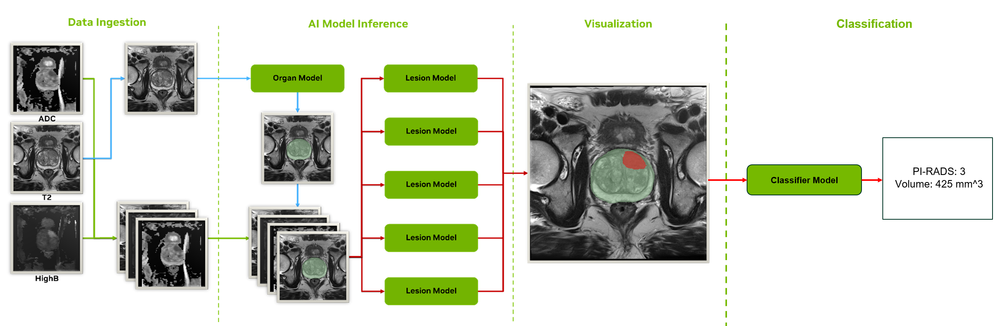
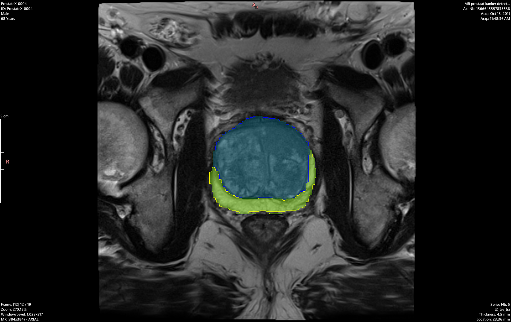
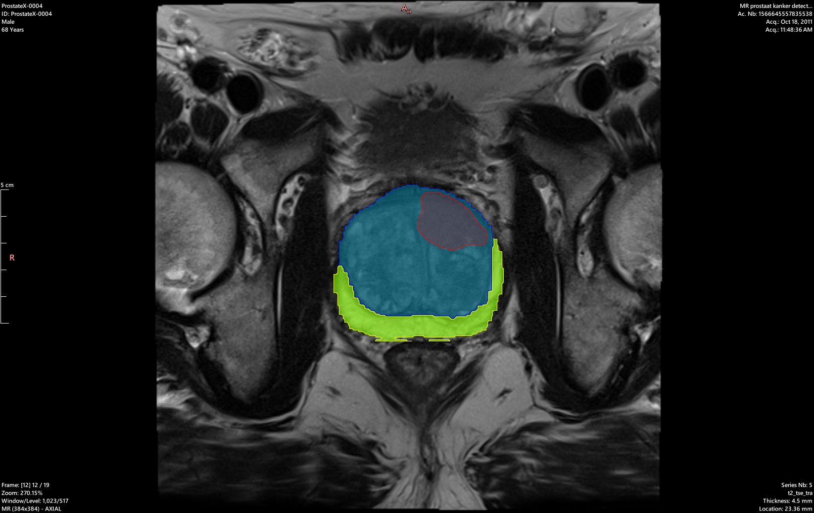
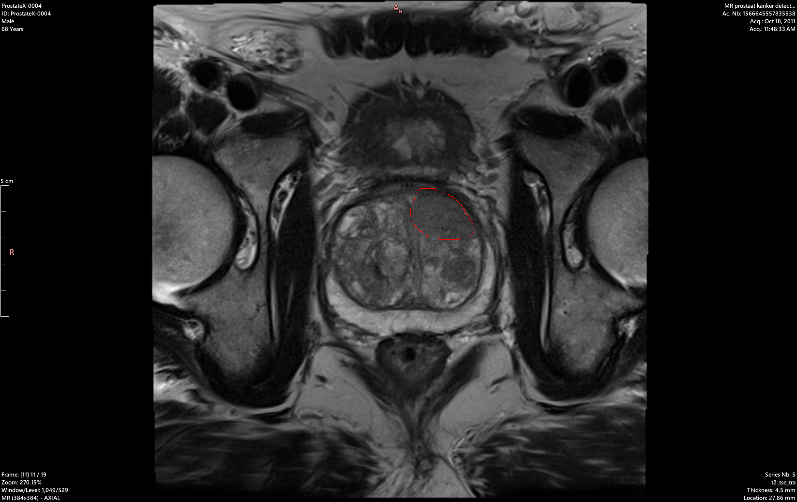

# Prostate MRI Lesion Segmentation and Classification (MONAI Deploy Pipeline)

<p float="left">
  
</p>

This application ingests multi-parametric prostate MRI DICOM studies (T2-weighted, ADC, and high b-value images), segments the prostate organ and lesions, and classifies detected lesions into PI‑RADS categories. It is implemented as a MONAI Deploy DAG with dedicated operators for ingestion, preprocessing, inference, and reporting.

This workflow takes T2, ADC, and HighB MRI series as input and produces several NIfTI files as output. These outputs contain organ and lesion segmentations and lesion probability maps.

<p float="left">
  
  
  
</p>

## What goes in (Inputs)

- DICOM study folder(s) containing at least one valid series for each of:
  - T2-weighted (T2)
  - Diffusion-derived ADC map (ADC)
  - High b‑value diffusion (HIGHB)
- Series auto-selection is done via curated regex rules on DICOM tags (Modality, ImageType, SeriesDescription). The app expects ProstateX-like naming but is robust across common site conventions.


## What comes out (Outputs)

- NIfTI versions of inputs (for reproducibility and downstream checks)
  - `output/t2/t2.nii.gz`
  - `output/adc/adc.nii.gz`
  - `output/highb/highb.nii.gz`
- Prostate organ segmentation (multi-class: background, TZ, PZ)
  - `output/organ/organ.nii.gz` (multi-class mask: 0=background, 1=TZ, 2=PZ)
- Lesion segmentation (per-fold and merged probabilities + final mask)
  - `output/lesion/fold{0..4}_lesion_prob.nii.gz` (5 folds)
  - `output/lesion/merged_lesion_prob.nii.gz`
  - `output/lesion/lesion_mask.nii.gz` (binary mask, post-processed)
- Lesion report with PI‑RADS and lesion statistics
  - `output/lesions.txt` (YAML: per-lesion PI‑RADS, major axis length, volume, plus organ stats)
- RTSTRUCT files (DICOM RT Structure Set)
  - `output/organ/organ.rtstruct.dcm`
  - `output/lesion/lesion.rtstruct.dcm`


## End-to-end pipeline (high level)

1) **Data ingestion**
- Load DICOM studies → select T2/ADC/HIGHB series using rules → convert each series to in‑memory 3D images with NIfTI metadata.

2) **Organ segmentation (prostate)**
- Preprocess T2: channel-first, RAS orientation, 1.0 mm isotropic resampling, intensity normalization.
- Infer prostate mask with a packaged MONAI model (sliding-window) and invert transforms to the original space.
- Save `output/organ/organ.nii.gz` as a multi-class mask (background/TZ/PZ).

3) **Lesion segmentation (ensemble, organ-masked)**
- Save T2/ADC/HIGHB/organ as NIfTI for reproducible preprocessing.
- Align ADC/HIGHB to T2 geometry; resample all to 0.5 mm isotropic.
- Compute ROI from the organ mask with a 32‑voxel margin and crop volumes to the ROI.
- Run a 5‑fold 3D RR‑UNet ensemble on the ROI, accumulate and average per-voxel probabilities.
- Multiply merged probabilities by the organ mask (remove out-of-prostate predictions).
- Threshold with a fixed value (0.6344772701607316) → `lesion_mask.nii.gz`.

4) **Lesion classification (PI‑RADS)**
- Resample T2/ADC/HIGHB/organ/lesion to 0.5 mm.
- Extract centered 64×64×64 crops around each connected component in the lesion mask.
- Classify crops using a lightweight 3D ResNet; map class index {0..3} → PI‑RADS {2..5}.
- Rule-based adjustment: if predicted=2 (PI‑RADS 4) and major axis length > 40 mm, upgrade to predicted=3 (PI‑RADS 5).
- Write lesion and organ stats to `output/lesions.txt`.


## Detailed components

### Data ingestion and series selection
- Orchestrated by `prostate_mri_lesion_seg_app/app.py` using MONAI Deploy:
  - `DICOMDataLoaderOperator` → `DICOMSeriesSelectorOperator` (rules per modality) → `DICOMSeriesToVolumeOperator` (in‑memory images).
- The DAG wires T2/ADC/HIGHB into downstream operators (organ seg → lesion seg → classifier).

### Organ segmentation
- Operator: `ProstateSegOperator` (`prostate_mri_lesion_seg_app/organ_seg_operator.py`)
- Preprocessing (T2):
  - Channel-first, RAS orientation, `Spacingd` to 1.0 mm, channel-wise z‑score normalization.
- Inference:
  - `MonaiSegInferenceOperator`, sliding-window ROI `(128, 128, 16)`, 50% overlap, batch size 4.
  - Model artifact: `models/organ/model.ts` (TorchScript).
  - Model loading: Operator looks for `model.ts` directly in the `model_path` directory.
- Post-processing:
  - Softmax → invert transforms → argmax with `threshold=None` → multi-class prostate mask (background/TZ/PZ) in original space.
  - The `threshold=None` parameter is critical to preserve all three classes (0=background, 1=TZ, 2=PZ); using a threshold would collapse to binary.

### Lesion segmentation (3D RR‑UNet ensemble, 5 folds)
- Operator: `ProstateLesionSegOperator` (`prostate_mri_lesion_seg_app/custom_lesion_seg_operator.py`)
- Inputs: T2, ADC, HIGHB, and organ mask (from Organ Seg).
- Preprocessing:
  - Save all inputs as NIfTI under `output/`.
  - Resample ADC/HIGHB to match T2 geometry (SimpleITK), then resample all to 0.5 mm isotropic.
  - Compute a prostate-centered ROI using `organ.nii.gz`, with a 32‑voxel margin; crop the inputs to the ROI.
  - Per-channel z‑score normalization across `[T2, ADC, HIGHB]`.
- Model:
  - `RRUNet3D` (residual encoder–decoder), 3 input channels, 2-class softmax output.
  - 5 instances with weights from `models/fold{0..4}/model_best_fold*.pth.tar`.
- Inference:
  - Patch-based over the ROI with strides sized to multiples of 32; accumulate sums and counts per voxel, then average.
  - Reconstruct to original size and save per-fold probability maps; average to `merged_lesion_prob.nii.gz`.
  - Parallel inference across all 5 folds using ThreadPoolExecutor.
- Post-processing:
  - Multiply merged probabilities by the organ mask (removes non-prostate detections).
  - Fixed threshold (0.6344772701607316) → `lesion_mask.nii.gz`.

### Lesion classification (PI‑RADS)
- Operator: `ProstateLesionClassifierOperator` (`prostate_mri_lesion_seg_app/custom_lesion_classifier_operator.py`)
- Inputs: T2, ADC, HIGHB, organ mask, lesion mask.
- Preprocessing:
  - `ResampleToMatch` ADC/HIGHB to T2, then resample all channels (and masks) to 0.5 mm isotropic.
  - Combine channels, normalize the first 3 (T2/ADC/HIGHB).
  - Extract 64×64×64 crops centered on each 3D lesion component.
- Model:
  - 3D ResNet (`resnet.py`), BasicBlock, layers `[1,1,1,1]`, channels `[32,64,128,256]`, `n_classes=4`.
  - Weights at `models/classifier/model_best.pth.tar`.
- Inference and rules:
  - Predict class index ∈ {0..3}; PI‑RADS = index + 2.
  - If predicted=2 (PI‑RADS 4) and major axis > 40 mm → promote to PI‑RADS 5.
- Reporting:
  - `lesions.txt` includes per-lesion ID, major axis length (mm), volume (mm³), PI‑RADS, plus prostate organ stats.


## How to run

### Software and Setup

In order to run this workflow and build a MAP you will need to [install MONAI Deploy App SDK](https://docs.monai.io/projects/monai-deploy-app-sdk/en/latest/getting_started/installing_app_sdk.html). This can be installed along with all other software dependencies by running `pip install -r prostate_mri_lesion_seg_app/requirements.txt`.

It is recommended to have an NVIDIA GPU with at least 12 GB of memory available.

### Models

The models needed to build and execute the pipeline (1 organ segmentation model, 5 lesion segmentation models, 1 classification model) are hosted separately on [Google Drive here](https://drive.google.com/drive/folders/1EpjrlzEdV7CcaCYqGTIEzOapamP4Ag6M?usp=sharing).

Download these models and put them inside a folder named `prostate_mri_lesion_seg_app/models` alongside the rest of the application code. Pipeline creation and execution will not complete if the model file path is changed or renamed.

The expected model directory structure:
```
models/
├── organ/
│   └── model.ts                    # TorchScript organ segmentation model
├── fold0/
│   └── model_best_fold0.pth.tar   # Lesion segmentation fold 0
├── fold1/
│   └── model_best_fold1.pth.tar   # Lesion segmentation fold 1
├── fold2/
│   └── model_best_fold2.pth.tar   # Lesion segmentation fold 2
├── fold3/
│   └── model_best_fold3.pth.tar   # Lesion segmentation fold 3
├── fold4/
│   └── model_best_fold4.pth.tar   # Lesion segmentation fold 4
└── classifier/
    └── model_best.pth.tar          # PI-RADS classification model
```

### Local (non-containerized)

Requirements are enumerated in `prostate_mri_lesion_seg_app/requirements.txt`. A quick way to run end‑to‑end:

```bash
./scripts/test_local.sh -i test-data/ProstateX-0004/ -o output/ -m models/
```

- GPU is used by default. Add `-c` to force CPU:

```bash
./scripts/test_local.sh -i test-data/ProstateX-0004/ -o output/ -m models/ -c
```

### MAP (containerized)

Build and run a MONAI Application Package (requires Holoscan CLI):

```bash
# Build (optional flag -b in helper script)
./scripts/test_MAP.sh -i test-data/ProstateX-0004/ -o output/ -m prostate_mri_lesion_seg_app/models/ -b

# Run a prebuilt MAP
./scripts/test_MAP.sh -i test-data/ProstateX-0004/ -o output/ -m prostate_mri_lesion_seg_app/models/
```

### Using this Repository

The easiest way to get started with this workflow is to run a test image taken from the [ProstateX](https://wiki.cancerimagingarchive.net/pages/viewpage.action?pageId=23691656) dataset. The `build_and_run.ipynb` file walks through this process using ProstateX-0004 which can be [downloaded separately](https://drive.google.com/drive/folders/1besSncSLlbeiv7UWveRJoOYQXOzu3JkU?usp=sharing) and placed in a `test-data/` directory.

After validating on test data, you can test this image on your own study or dataset. One of the main considerations when adapting to a new dataset will be the making sure the [DICOM Series Selector Operator](https://docs.monai.io/projects/monai-deploy-app-sdk/en/latest/modules/_autosummary/monai.deploy.operators.DICOMSeriesSelectorOperator.html#monai.deploy.operators.DICOMSeriesSelectorOperator) is configured to properly differentiate between the different naming schemes and properties of the new dataset.

If all three (T2, ADC, HighB) series are not detected properly in the study, the pipeline will not complete. If any of these modalities are incorrectly routed, the pipeline results will not be accurate. The workflow currently saves intermediate copies (in NIfTI) of these series in the output folder so it is possible to verify they were picked up (and preprocessed) correctly.

The current set of rules in `app.py` filter based on SeriesDescription, ImageType, etc., and work with ProstateX. Please refer to MONAI documentation for guidance on modifying these rules for custom filtering.


## Training

The repository includes training infrastructure for both organ and lesion segmentation models.

### Organ Segmentation Training

- Notebook: `notebooks/train_organ.ipynb`
- Model: Multi-class RRUNet3D (3 output channels: background, TZ, PZ)
- Training script: `training/train_organ.py`
- Configuration: `configs/organ.yaml`
- 5-fold cross-validation training
- Output: TorchScript model (`model.ts`) for deployment

### Lesion Segmentation Training

- Notebook: `notebooks/train_lesion.ipynb`
- Model: Binary RRUNet3D (2 output channels: background, lesion)
- Training script: `training/train_lesion.py`
- Configuration: `configs/lesion.yaml`
- 5-fold cross-validation training (ensemble)
- Input: Multi-parametric (T2 + ADC + HIGHB, 3 channels)
- ROI cropping with 32-voxel margin
- Handles missing lesion masks (creates empty masks for patients without lesions)

### Training Infrastructure

- Training engine: `training/engine.py`
- Datasets: `training/datasets.py`
- Transforms: `training/transforms.py`
- Losses: `training/losses.py`
- Metrics: `training/metrics.py`
- Utilities: `training/utils.py`


## Evaluation

- Compare organ and lesion masks using DICE:

```bash
./scripts/compare_output.sh <reference_dir> <output_dir>
```

This calls `scripts/eval_dice.py` under the hood (loads two NIfTI files, computes mean DICE).


## Models and artifacts

- Organ segmentation: `models/organ/model.ts` (TorchScript, used by MONAI Deploy inference operator).
- Lesion segmentation: `models/fold0..fold4/model_best_fold*.pth.tar` (5‑fold RR‑UNet ensemble).
- Lesion classifier: `models/classifier/model_best.pth.tar` (3D ResNet, 4 classes → PI‑RADS 2–5).
- Outputs are written under `output/` as described above.


## Assumptions and constraints

- Assumes valid T2, ADC, and high b‑value series are present; selection is regex-based and tuned for ProstateX-like names.
- Resampling strategy: organ seg at 1.0 mm; lesion seg/classifier at 0.5 mm isotropic.
- Lesion segmentation is explicitly organ‑constrained:
  - ROI crop for inference is centered on the prostate mask with a margin.
  - Post-inference probabilities are multiplied by the organ mask prior to thresholding.
- Fixed lesion threshold (0.6344772701607316) after ensemble averaging.
- Organ segmentation produces multi-class output (background/TZ/PZ) when `threshold=None` is used in post-processing.
- GPU strongly recommended (PyTorch + 3D inference); CPU fallback supported.


## Comparison-ready highlights

- Multi-parametric inputs (T2 + ADC + high b‑value), with curated series selection rules, increase robustness to site naming variability.
- Two-stage approach:
  - Organ segmentation ensures prostate-focused processing and provides multi-class anatomical zones (TZ/PZ).
  - Lesion segmentation is both ROI‑focused and organ‑masked for fewer false positives.
- 5‑fold ensemble improves lesion robustness and calibration; fold probabilities are exported for transparency.
- PI‑RADS classification uses 3D crops and a size-based rule to better separate 4 vs. 5.
- Clear, audit-friendly artifacts: NIfTI inputs/outputs, merged probabilities, final masks, RTSTRUCT files, and a concise YAML report.


## Key source files

- Pipeline and DAG: `prostate_mri_lesion_seg_app/app.py`
- Organ segmentation operator: `prostate_mri_lesion_seg_app/organ_seg_operator.py`
- Lesion segmentation operator: `prostate_mri_lesion_seg_app/custom_lesion_seg_operator.py`
- Lesion classifier operator: `prostate_mri_lesion_seg_app/custom_lesion_classifier_operator.py`
- Models: `prostate_mri_lesion_seg_app/rrunet3D.py`, `prostate_mri_lesion_seg_app/resnet.py`
- Utilities: `prostate_mri_lesion_seg_app/common.py`, `prostate_mri_lesion_seg_app/rtstruct_utils.py`
- Training: `training/engine.py`, `training/train_organ.py`, `training/train_lesion.py`
- Scripts: `scripts/test_local.sh`, `scripts/test_MAP.sh`, `scripts/compare_output.sh`, `scripts/eval_dice.py`


## Quick sanity check after a run

- Confirm outputs exist:
  - `output/t2/t2.nii.gz`, `output/adc/adc.nii.gz`, `output/highb/highb.nii.gz`
  - `output/organ/organ.nii.gz` (multi-class: 0=background, 1=TZ, 2=PZ)
  - `output/lesion/fold*_lesion_prob.nii.gz`, `output/lesion/merged_lesion_prob.nii.gz`, `output/lesion/lesion_mask.nii.gz`
  - `output/lesions.txt` (PI‑RADS per lesion)
  - `output/organ/organ.rtstruct.dcm`, `output/lesion/lesion.rtstruct.dcm` (if RTSTRUCT generation succeeds)

If you need a simple visualization, see `build_and_run.ipynb` for an example to overlay organ/lesion masks on T2.


## Scripts

There are several scripts to help with validation and development included in the `scripts/` directory.

- `scripts/test_local.sh`: Execute workflow locally on test images without building a MAP.
- `scripts/test_MAP.sh`: Execute MAP workflow on test images with option to rebuild MAP.
- `scripts/compare_output.sh`: Computes organ and lesion DICE scores for two output directories.
- `scripts/test_batch.sh`: Batch processing script for multiple patients.


## Publications

Several publications have leveraged this workflow either in part or in full.

Esengur, Omer Tarik, et al. ["Assessing the Impact of Transition and Peripheral Zone PSA Densities Over Whole‐Gland PSA Density for Prostate Cancer Detection on Multiparametric MRI."](https://onlinelibrary.wiley.com/doi/abs/10.1002/pros.24863) The Prostate (2025): e24863.

Yilmaz, Enis C., et al. ["External Validation of a Previously Developed Deep Learning–based Prostate Lesion Detection Algorithm on Paired External and In-House Biparametric MRI Scans."](https://pubs.rsna.org/doi/abs/10.1148/rycan.240050) Radiology: Imaging Cancer 6.6 (2024): e240050.

Lin, Yue, et al. ["Evaluation of a Cascaded deep learning–based algorithm for prostate lesion detection at biparametric MRI."](https://pubs.rsna.org/doi/abs/10.1148/radiol.230750) Radiology 311.2 (2024): e230750.

Simon, Benjamin D., et al. ["Automated detection and grading of extraprostatic extension of prostate cancer at MRI via cascaded deep learning and random forest classification."](https://www.sciencedirect.com/science/article/abs/pii/S1076633224002204) Academic Radiology 31.10 (2024): 4096-4106.

Johnson, Latrice A., et al. ["Automated prostate gland segmentation in challenging clinical cases: comparison of three artificial intelligence methods."](https://link.springer.com/article/10.1007/s00261-024-04242-7) Abdominal Radiology 49.5 (2024): 1545-1556.


## License

This work was developed by NVIDIA and the NIH National Cancer Institute (NCI). Please refer to the LICENSE for terms of use.
